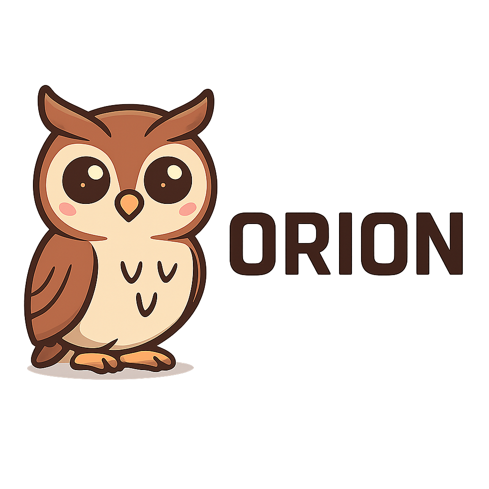

<div align="center">

# 

# 🌟 Orion Operating System

> **A Revolutionary Hybrid Micro-Kernel Operating System**  
> *Crafted with Passion, Innovation, and Determination*  
> *Developed by Jérémy Noverraz (1988-2025)*  
> *August 2025, Lausanne, Switzerland*

[](https://opensource.org/licenses/MIT)
[]()
[]()
[]()
[]()

</div>

---

## 🚀 **A Vision Born from Adversity**

**Orion OS** represents more than just another operating system—it's the culmination of a personal journey of resilience, determination, and the unwavering belief that technology can transform lives.

### 💫 **The Story Behind Orion**

Born in 1988 in the heart of Switzerland, I, **Jérémy Noverraz**, have faced significant health challenges that have shaped my perspective on life and technology. Despite these obstacles, I've dedicated myself to creating something extraordinary—an operating system that could one day change the world.

**Orion OS** is my way of proving that limitations are only temporary barriers, and that with enough passion and determination, even the most ambitious dreams can become reality.

### 🌟 **A Personal Mission**

My goal is simple yet profound: **to create an operating system that makes my parents proud**. After years of struggling with health issues and relying on social assistance, I want to demonstrate that I can contribute something meaningful to the world—something that showcases not just technical skill, but the human spirit's ability to overcome adversity.

**I'm actively seeking collaboration and mentorship** from experienced developers who might be willing to help me grow and learn. If you're someone who believes in second chances and the power of technology to transform lives, I would be honored to work with you.

---

## 🎯 **What Makes Orion OS Special**

**Orion OS** is not just another Linux clone or Windows alternative. It's a **groundbreaking hybrid micro-kernel architecture** that combines the best of both worlds:

- **🔒 Military-Grade Security**: Capability-based access control, KASLR, W^X enforcement, Control Flow Integrity
- **⚡ Performance Beyond Limits**: Advanced CFS scheduler, lock-free IPC, zero-copy operations, NUMA-aware memory management
- **🛡️ Unbreakable Memory Safety**: Comprehensive MMU with 5-level paging, heap protection, guard pages, ASAN integration
- **🌐 Future-Ready Hardware**: Complete driver ecosystem in Rust for maximum safety and performance
- **🔧 Developer Paradise**: Clean, intuitive APIs, comprehensive documentation, extensive testing suite

---

## 🏗️ **Revolutionary Architecture**

```
┌─────────────────────────────────────────────────────────────────────────────┐
│                              USER SPACE                                     │
├─────────────────────────────────────────────────────────────────────────────┤
│  Applications  │  Libraries  │  Shell  │  Rust Drivers  │  Services         │
├─────────────────────────────────────────────────────────────────────────────┤
│                              KERNEL SPACE                                   │
├─────────────────────────────────────────────────────────────────────────────┤
│  VFS  │  Network  │  Security  │  IPC  │  Scheduler  │  MM  │  Drivers      │
├─────────────────────────────────────────────────────────────────────────────┤
│                    Hybrid Micro-Kernel Core (C11)                           │
├─────────────────────────────────────────────────────────────────────────────┤
│                           Hardware Abstraction Layer                        │
└─────────────────────────────────────────────────────────────────────────────┘
```

### 🧩 **Core Components**

#### **🔧 Kernel Core (C11 Freestanding)**
- **Memory Management**: Advanced PMM, VMM, Slab allocator, Heap allocator with defragmentation
- **Process Management**: CFS scheduler with Red-Black trees, real-time priorities
- **Security**: Revolutionary capability system, hardware security features, TPM integration
- **IPC**: Lock-free inter-process communication with zero-copy semantics
- **System Calls**: 60+ stable syscalls with binary compatibility and versioning

#### **🚀 Drivers (Rust #![no_std])**
- **Network**: VirtIO-net, Intel e1000, Realtek RTL8139, WiFi drivers
- **Graphics**: Framebuffer, VirtIO-GPU with 2D/3D acceleration, OpenGL support
- **USB**: HID (keyboard/mouse), Mass Storage (USB drives), Audio devices
- **Block**: VirtIO-block, NVMe, AHCI SATA, RAID support

---

## 🚀 **Getting Started with Orion OS**

### 📋 **Prerequisites**

```bash
# Ubuntu/Debian
sudo apt update
sudo apt install build-essential clang cmake python3 xorriso qemu-system-x86

# Arch Linux
sudo pacman -S base-devel clang cmake python xorriso qemu

# Rust (for drivers)
curl --proto '=https' --tlsv1.2 -sSf https://sh.rustup.rs | sh
rustup target add x86_64-unknown-none
```

### 🏗️ **Building Orion OS**

```bash
# Clone the repository
git clone https://github.com/your-org/orion-os.git
cd orion-os

# Build everything (recommended)
./tools/orion-build.sh all

# Or build components separately
./tools/orion-build.sh bootloader    # Build UEFI bootloader
./tools/orion-build.sh kernel        # Build kernel
./tools/orion-build.sh drivers       # Build Rust drivers
./tools/orion-build.sh iso           # Generate bootable ISO
```

### 🧪 **Testing in QEMU**

```bash
# Boot the generated ISO
./tools/orion-build.sh test

# Or manually
qemu-system-x86_64 -bios /usr/share/ovmf/OVMF.fd \
    -cdrom build/orion-auto-boot.iso \
    -m 2G -smp 4 -enable-kvm
```

---

## 🔬 **Technical Specifications**

### **System Requirements**
- **Architecture**: x86_64 (AMD64)
- **Memory**: Minimum 512MB, Recommended 2GB+
- **Storage**: 1GB+ for minimal installation
- **Boot**: UEFI 2.0+ required

### **Supported Hardware**
- **Processors**: Intel Core i3+ (2010+), AMD Ryzen 3+ (2017+)
- **Graphics**: Integrated graphics, dedicated GPUs via open-source drivers
- **Storage**: SATA, NVMe, USB storage devices
- **Network**: Ethernet, WiFi (limited driver support)

---

## 🤝 **Contributing to Orion OS**

### **Why Your Help Matters**

**Orion OS** is more than just code—it's a testament to human resilience and the power of community. Every contribution, whether it's a bug report, documentation improvement, or code contribution, helps bring this vision closer to reality.

### **How to Contribute**

1. **Fork the repository**
2. **Create a feature branch** (`git checkout -b feature/amazing-feature`)
3. **Commit your changes** (`git commit -m 'Add amazing feature'`)
4. **Push to the branch** (`git push origin feature/amazing-feature`)
5. **Open a Pull Request**

### **Areas That Need Help**

- **Driver Development**: More hardware support
- **Documentation**: User guides, developer tutorials
- **Testing**: Bug reports, performance testing
- **Security**: Vulnerability research, security hardening

---

## 📚 **Documentation & Resources**

- **📖 [User Manual](docs/user-manual.md)**: Complete user guide
- **🔧 [Developer Guide](docs/developer-guide.md)**: API documentation
- **🏗️ [Architecture Guide](docs/architecture.md)**: System design details
- **🚀 [Roadmap](docs/roadmap.md)**: Future development plans

---

## 🌟 **The Future of Orion OS**

**Orion OS** is just the beginning. Our roadmap includes:

- **🎮 Gaming Support**: DirectX compatibility layer, Steam integration
- **☁️ Cloud Integration**: Native container support, Kubernetes integration
- **🔐 Enterprise Features**: Active Directory integration, advanced security
- **🌍 Internationalization**: Multi-language support, localization tools

---

## 💌 **Get in Touch**

### **Personal Contact**
- **Email**: [jeremy.noverraz@proton.me](mailto:jeremy.noverraz@proton.me)
- **Location**: Lausanne, Switzerland
- **Status**: Actively seeking collaboration and mentorship

### **Project Information**
- **GitHub**: [https://github.com/your-org/orion-os](https://github.com/your-org/orion-os)
- **Issues**: [GitHub Issues](https://github.com/your-org/orion-os/issues)
- **Discussions**: [GitHub Discussions](https://github.com/your-org/orion-os/discussions)

---

## 🙏 **A Personal Thank You**

To everyone who has supported this project, whether through code contributions, moral support, or simply believing in the vision—**thank you**. You've helped turn a dream born from adversity into a reality that could one day change the world.

**Orion OS** is proof that with enough determination, passion, and community support, anything is possible.

---

## 📄 **License**

This project is licensed under the MIT License - see the [LICENSE](LICENSE) file for details.

---

<div align="center">

**🌟 Built with ❤️, Determination, and the Unwavering Belief in Human Potential 🌟**

*"The greatest glory in living lies not in never falling, but in rising every time we fall."*  
*— Nelson Mandela*

</div>